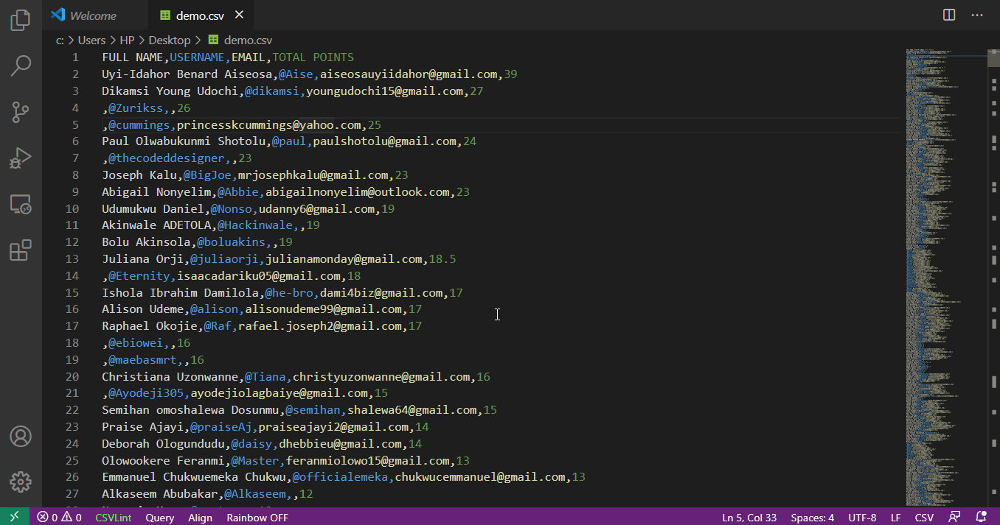
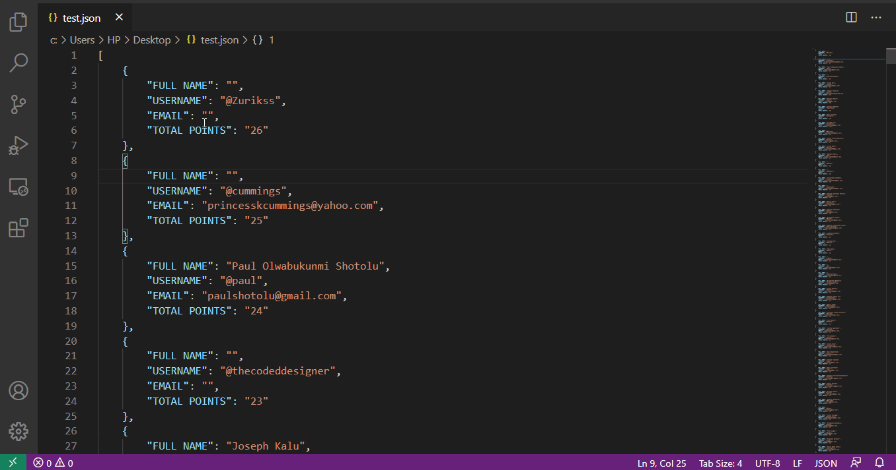

# CSV to JSON Converter

A Visual Studio Code extension that converts documents between CSV and JSON formats. Converting documents between the two formats is now as easy as it sounds, plus you get the converted document in a well-structured format.

## Features

* Swift conversion.
* Saves converted document to a new file with the same name and folder as those of the old file, and it prompts you to open the new file after conversion.
* Converts documents with readable and well-structured formatting.
* Dedicated keyboard shortcuts for quick and easy conversion.

## Usage

* Focus the cursor on the text editor containing the document to be converted

* Bring up the command palette using the keyboard shortcut Ctrl+Shift+P on Windows/Linux or Cmd+Shift+P or F1 on macOS

* Search for "Convert CSV to JSON" or "Convert JSON to CSV" on the dialog box that comes up, as the case may be, then press Enter.

* This extension comes with a dedicated keyboard shortcut. Thus, alternatively, when the text editor is on focus, use the keyboard shortcut Ctrl+Alt+J on Windows/Linux or Cmd+Option+J on macOS to convert a CSV document to JSON, and Ctrl+Alt+C on Windows/Linux or Cmd+Option+C on macOS to convert a JSON document to CSV.

## Release Notes

### 1.0.0

This is the initial release of the extension. Check the [features](https://github.com/Chukwuamaka/csvtojson-converter#features) section to know the current capabilities of the extension.

## Known Issues

The current version of this extension does not have a good support for multilevel/nested JSON to CSV conversion yet. You should consider contributing to the source code.

To report an issue, go to [issues](https://github.com/Chukwuamaka/csvtojson-converter/issues).

## Contribution

Here are some awesome ways you can contribute:

* Extend the capabilities of the extension by contributing to the source code.
> To contribute to the source code, edit the extension.js file and make corresponding changes in the package.json file.
* Report and solve issues/bugs. 
* Make feature requests.
* Review source code changes.
* Review the documentation and make pull requests for anything, from typos to new content.

We would be happy to receive your contributions towards this project 😃. You will be contributing to the common good.

## Feedback

Let me know what you think by:
* Sending a [mail](mailto:osujichukwuamaka@gmail.com)
* Sending a private message on [LinkedIn](https://www.linkedin.com/in/chukwuamakaosuji/) or [Twitter](https://twitter.com/SenseiAmaka)

## License

This extension and its code are licensed under the MIT license.

## Credits

Extension logo/icon was designed by 

-----------------------------------------------------------------------------------------------------------

**Enjoy!** 😃